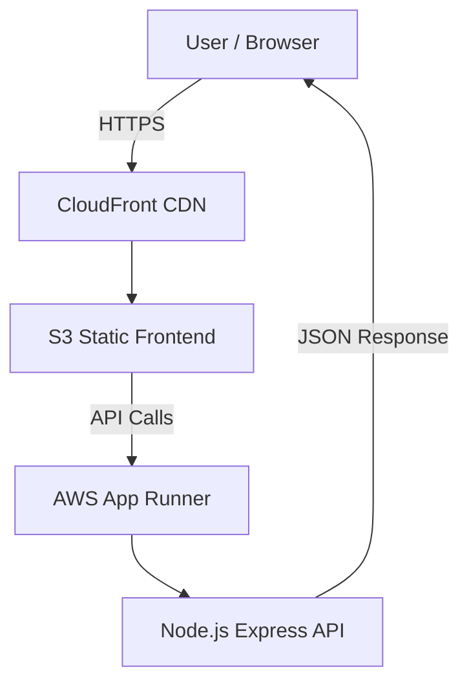

# 🎬 AshFlix – Netflix-Style AI Streaming SaaS  
### DevSecOps & Cloud Engineering Portfolio

---

## 📌 Project Overview

**AshFlix** is a Netflix-inspired streaming SaaS demo built to demonstrate **real-world DevSecOps and cloud architecture patterns**.

This project focuses on:
- Production-style AWS infrastructure
- Secure containerized backend services
- CI/CD discipline
- Infrastructure ownership using Terraform
- Clear separation between **stateless services** and **persistent data**

It is intentionally designed to be **free-tier conscious**, **auditable**, and **interview-ready**.

---

## 🧠 Key Highlights

- ⚙️ Full-stack cloud-native architecture
- 🎨 Netflix-style React UI (Vite)
- ☁️ AWS S3 + CloudFront global delivery
- 🐳 Dockerized backend on AWS App Runner
- 🛠️ Infrastructure-as-Code with Terraform
- 🔐 Security-first DevSecOps practices
- 🚀 CI/CD for frontend delivery

---

## 🚀 Live Endpoints

**Frontend (CloudFront CDN)**  
👉 https://d18qc73pgklufe.cloudfront.net

**Backend (AWS App Runner)**  
👉 https://p3xh7pammx.eu-west-1.awsapprunner.com

---

## 🎨 Frontend Features (Implemented)

- Cinematic Netflix-style UI
- API-driven movie catalog
- Watch-page demo player
- Backend health debug panel
- Optimized Vite production build
- Global CDN delivery via CloudFront

---

## 🤖 Backend Features (Implemented)

- Node.js + Express REST API
- Dockerized container image
- Hosted on AWS App Runner
- HTTPS enabled by default
- `/health` endpoint
- `/api/catalog` endpoint
- CORS restricted to CloudFront domain

---

## ☁️ Cloud Infrastructure (Implemented)

- Amazon S3 (static frontend hosting)
- Amazon CloudFront (global CDN)
- AWS App Runner (container backend)
- Amazon ECR (Docker image registry)
- IAM (least-privilege access)
- Terraform for infrastructure management

---

## 🏗️ High-Level Architecture

🔌 API Contract (Sample)
Health Check
bash
Copy code
GET /health
Response:

json
Copy code
{ "status": "ok" }
Catalog API
bash
Copy code
GET /api/catalog
Sample response:

json
Copy code
{
  "sections": [
    {
      "title": "Trending Now",
      "items": [
        {
          "id": "movie-1",
          "title": "AshFlix Original",
          "poster": "/posters/movie-1.jpg"
        }
      ]
    }
  ]
}
🔄 CI/CD Pipeline (Safe Mode)
Scope: Frontend only
Trigger: Push to main

Pipeline stages:

Vite production build

Sync build artifacts to S3

CloudFront cache invalidation

Intentionally disabled:

Backend auto-deploy

Terraform apply in CI

Secrets in repository

This design prioritizes safety, cost control, and auditability.

📊 Monitoring & Observability
CloudWatch Logs & Metrics (via App Runner)

Managed metrics: CPU, memory, latency, request count

CloudWatch Alarm
Name: ashflix-backend-high-cpu

Metric: CPUUtilization

Condition: >70% for 10 minutes

Purpose: Early saturation detection

Note: Alarm bootstrapped via AWS Console due to org-level IAM/SCP guardrails — reflecting real enterprise constraints.

🔐 Security & DevSecOps Practices
IAM-scoped AWS credentials

Secrets stored in GitHub Actions Secrets

No hard-coded credentials

CORS locked to CloudFront domain

Infrastructure managed via Terraform

Free-tier-safe architecture decisions

Containers designed to be stateless

🧩 STEP 5 — Docker & Compose → AshFlix / FootyIQ Mapping
This project is backed by local Docker and Docker Compose environments used to model production systems before cloud deployment.

Local (Docker / Compose)
Multi-container services (app + database)

Persistent volumes for stateful components

Explicit service dependencies

One-command lifecycle (docker compose up/down)

Production (AWS)
Local Docker Concept	AWS Production Equivalent
App container	ECS / App Runner
Database container	Amazon RDS
Docker volume	RDS managed storage
Docker network	AWS VPC
Port mappings	ALB / CloudFront
Docker Compose	Terraform (IaC)

The same architecture patterns are reused across:

AshFlix (Streaming SaaS)

FootyIQ (Football analytics & data API)

This demonstrates architecture consistency across environments, a core DevSecOps principle.

🧰 Tech Stack
Frontend

React

Vite

TypeScript

CSS Modules

Backend

Node.js

Express

Docker

AWS App Runner

Infrastructure & DevOps

AWS S3

AWS CloudFront

AWS ECR

AWS IAM

Terraform

GitHub Actions

Docker & Docker Compose

📦 Repository Structure
bash
Copy code
ashflix/
├── frontend/          # React + Vite UI
├── backend/           # Node.js Express API
├── infra/             # Terraform IaC
│   ├── s3-cloudfront/
│   ├── apprunner/
│   └── ecr/
├── docker-labs/       # Docker & Compose architecture labs
├── .github/workflows/ # CI/CD pipelines
└── README.md
🎬 AshFlix Helix Ident (Brand Concept)
Visual: Helix / arc motion resolving into the AshFlix mark

Sound cue: Short “Àh-boom” hit synced to logo lock-in

Goal: Instant brand recognition like real streaming platforms

🛣️ Roadmap (Planned)
Streaming & Media

Adaptive streaming

Auth-gated content

User watch history

Platform & DevOps

Backend CI/CD with OIDC

ECS Fargate migration

Secrets Manager integration

CloudWatch dashboards

Multi-environment Terraform

🎯 Why This Project Matters
AshFlix is a realistic DevSecOps portfolio project, not a toy app.

It demonstrates:

Cloud infrastructure ownership

CI/CD discipline

Containerized system design

Security-first thinking

Production-grade decision making

Built intentionally for DevOps / Cloud / Platform Engineer interviews.

👤 Author
Uwem Udo (ashNikov)
DevSecOps & Cloud Engineer
AI-Driven SaaS Portfolio Projects: AshFlix
