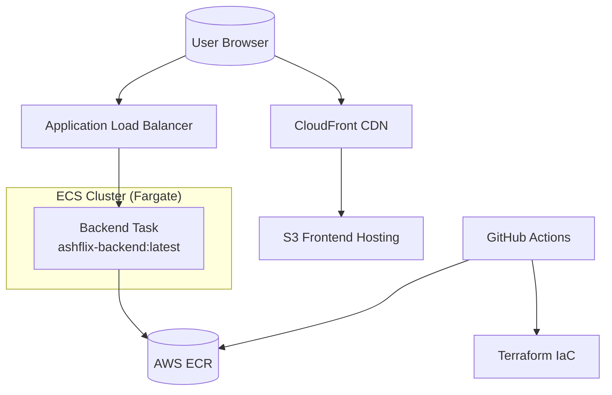
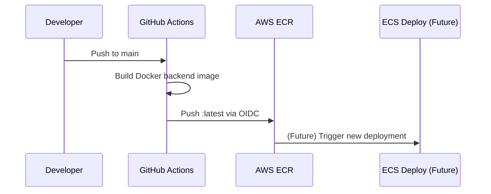
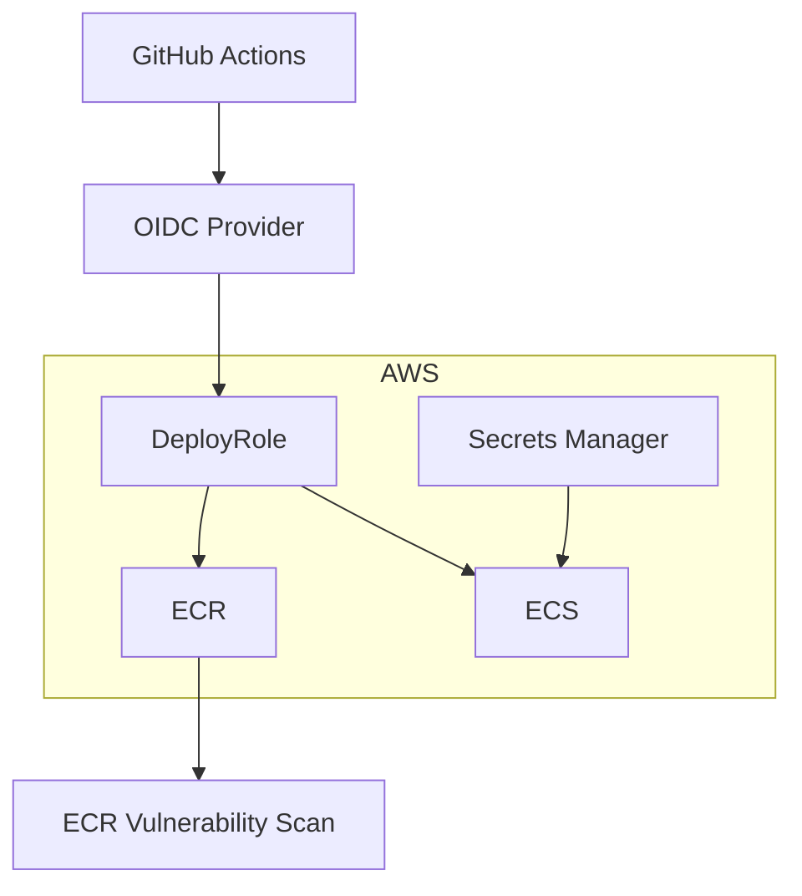
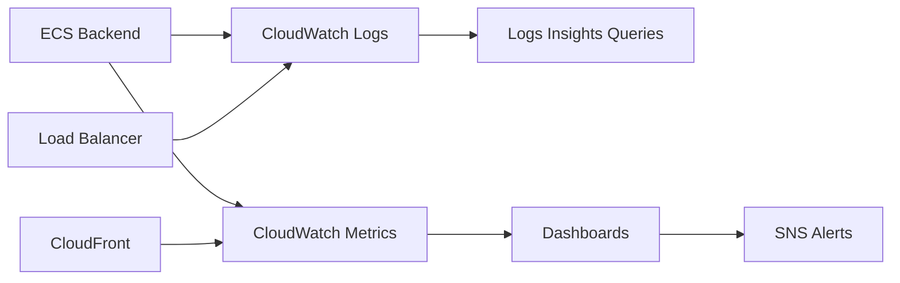
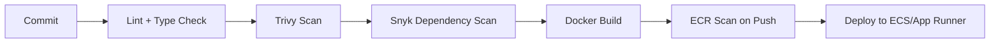

<h1 align="center">🎬 AshFlix — AI Streaming SaaS</h1>
<p align="center">A Production-Grade DevSecOps Portfolio Project • Docker • Terraform • AWS • CI/CD • ECS • Observability</p>

<p align="center">
  
  
  
  
  
  
</p>

---

# 📌 Overview  
AshFlix is a **Netflix-style AI streaming platform** built as a **full DevSecOps + Cloud Engineering showcase**.  
It demonstrates:

- 🐳 **Dockerized microservices**  
- ⚙️ **GitHub Actions CI/CD with OIDC (no access keys)**  
- ☁️ **AWS ECR container registry**  
- 🧱 **Terraform Infrastructure-as-Code**  
- 🚀 **ECS Fargate production-ready architecture**  
- 🔐 **Zero-trust IAM + image scanning + DevSecOps pipeline**  
- 📊 **CloudWatch Observability + SRE dashboards**  

---

# 🧱 Project Structure  
```
ashflix/
  frontend/          # React + Vite + Nginx build
  backend/           # Node.js + Express API
  infra/
    terraform/       # AWS IaC (ECR, IAM, App Runner/ECS)
  .github/workflows/ # CI/CD pipelines
  README.md
```

---

# ⚙️ Architecture (Phase 1 — Local + Docker + AWS ECR)

## 🏗️ Local Dev + Docker Architecture
```mermaid
flowchart LR
    subgraph Dev["Developer Machine"]
        FE[React Frontend] 
        BE[NodeJS Backend]
        Docker[Docker Desktop]
    end

    Docker --> FEContainer[Frontend Container (Nginx)]
    Docker --> BEContainer[Backend Container]

    FEContainer --> User[(User Browser)]
    BEContainer --> User
```

---

# ☁️ AWS Cloud Architecture (Phase 2 — ECS Production)



---

# 🔄 CI/CD Pipeline Architecture



---

# 🛡️ Security Architecture (IAM + OIDC + Zero Trust)



---

# 📊 Observability Architecture (CloudWatch)



---

# 🚀 Features Delivered (Phase 1)

### ✔ **Frontend**
- React + Vite
- Nginx production build
- AshFlix cinematic intro
- Modal UI + authentication mock

### ✔ **Backend**
- Express API
- `/health` + `/catalog` endpoints
- Dockerized for production

### ✔ **DevOps**
- Docker images for both services  
- Docker Compose multi-service environment  
- GitHub Actions CI/CD pipeline  
- OIDC authentication (no AWS keys needed)  
- Backend image automatically pushed to ECR  
- Terraform setup with ECR + IAM + outputs  

---

# 🛠️ DevSecOps Pipeline (Security Gates)



---

# 📦 AWS Infrastructure (Terraform)

Provisioned so far:

- **ECR repository**
- **IAM OIDC Deploy Role**
- **Lifecycle rules**
- **Terraform state + outputs**

Outputs example:
```
backend_ecr_repo_url = "183376096120.dkr.ecr.eu-west-1.amazonaws.com/ashflix-backend"
```

---

# 🚧 Phase 2 (Upcoming)
- ECS Fargate deployment  
- CloudFront + S3 for frontend hosting  
- HTTPS (ACM certificate)  
- Secrets Manager  
- ALB + Auto scaling  
- Monitoring dashboards  

---

# 🏁 Summary
AshFlix now demonstrates a **real-world DevSecOps workflow**, including:

- Modern CI/CD  
- Secure AWS deployment  
- Docker microservices  
- Infrastructure-as-Code  
- Monitoring & security foundations  

This project serves as a **strong DevOps, Cloud, and Platform Engineering portfolio piece**.

---

# 👨‍💻 Author  
Built by **Uwem Udo (ashNikov)** — DevSecOps Engineer in progress.


