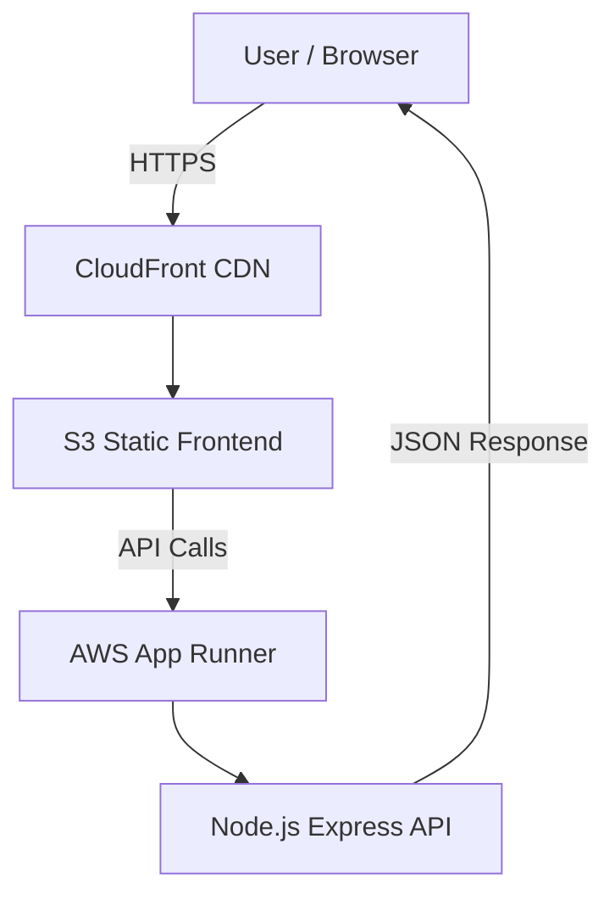

# 🎬 AshFlix – Netflix-Style AI Streaming SaaS (DevSecOps Portfolio)

---

**AshFlix** is a **Netflix-inspired streaming SaaS demo** built with a **real-world DevSecOps architecture**.  
It showcases production-style AWS infrastructure, secure CI/CD workflows, and cloud-native deployment patterns — all **free-tier conscious**.

---

## 🧠 Highlights

⚙️ Full-stack cloud architecture  
🎨 Netflix-style React UI (Vite)  
☁️ AWS S3 + CloudFront global delivery  
🐳 Containerized backend on AWS App Runner  
🛠️ Infrastructure-as-Code with Terraform  
🔐 Security-first DevSecOps practices  
🚀 Production deployment with CI/CD (frontend)

---

## 🚀 Live Demo

🌍 **Frontend (CloudFront)**  
👉 https://d18qc73pgklufe.cloudfront.net  

🧠 **Backend (AWS App Runner)**  
👉 https://p3xh7pammx.eu-west-1.awsapprunner.com  

---

## 🎨 Frontend Features (Implemented)

- 🎬 Cinematic Netflix-style UI
- 📂 API-driven movie catalog
- ▶️ Watch-page demo player
- 🧪 Backend health debug panel
- ⚡ Optimized Vite production build
- 🌍 Served globally via CloudFront CDN

---

## 🤖 Backend Features (Implemented)

- Node.js + Express API
- Dockerized container
- Hosted on AWS App Runner
- HTTPS enabled by default
- `/health` endpoint
- `/api/catalog` endpoint
- CORS restricted to CloudFront domain

---

## ☁️ Infrastructure (Implemented)

- Amazon S3 (static frontend hosting)
- Amazon CloudFront (global CDN)
- AWS App Runner (container backend)
- Amazon ECR (Docker images)
- IAM (least-privilege access)
- Terraform for infrastructure management

---

## 🏗️ Architecture Diagram (Mermaid)

📡 API Contract
Health Check
http
Copy code
GET /health
Response

json
Copy code
{
  "status": "ok"
}
Catalog API
http
Copy code
GET /api/catalog
Response (Sample)

json
Copy code
{
  "sections": [
    {
      "title": "Trending Now",
      "items": [
        {
          "id": "movie-1",
          "title": "AshFlix Original",
          "poster": "/posters/movie-1.jpg"
        }
      ]
    }
  ]
}
🔄 CI/CD Pipeline (Safe Mode)
Current Scope: Frontend only

Trigger: push to main

Build: Vite production build

Deploy:

Sync build artifacts to S3

CloudFront cache invalidation

❗ Intentionally Disabled
❌ No backend auto-deploy

❌ No Terraform apply in CI

❌ No secrets committed to repository

This design ensures maximum safety, cost control, and auditability.

🔐 Security & DevSecOps Practices
IAM-scoped AWS credentials

Secrets stored in GitHub Actions Secrets

No hard-coded credentials

CORS locked to CloudFront domain

Infrastructure managed via Terraform

Free-tier-safe design choices

🧰 Tech Stack
Frontend
React

Vite

TypeScript

CSS Modules

Backend
Node.js

Express

Docker

AWS App Runner

Infrastructure
AWS S3

AWS CloudFront

AWS ECR

AWS IAM

Terraform

GitHub Actions

📦 Folder Structure
text
Copy code
ashflix/
├── frontend/          # React + Vite UI
├── backend/           # Node.js Express API
├── infra/             # Terraform IaC
│   ├── s3-cloudfront/
│   ├── apprunner/
│   └── ecr/
├── .github/workflows/ # CI/CD pipelines
└── README.md
🛣️ Roadmap (Planned Features)
(Future work – NOT implemented today)
---

## 🎬 AshFlix Helix Ident (Brand Intro)

AshFlix includes a signature intro concept inspired by modern streaming platforms — a short **Helix Ident** that plays on first load:

- **Visual:** subtle helix/arc motion that resolves into the AshFlix mark
- **Sound cue:** a short “Àh-boom” hit synced to the logo lock-in
- **Goal:** instantly brand the experience like a real streaming product

### Where it lives in the app
- Intro animation: `frontend/src/...` (UI intro component)
- Sound asset: `frontend/public/...` (served from the static root)
- Playback triggered on: first load / route entry (client-side)

### Future upgrades (planned)
- User setting: “Skip Intro”
- Preload audio for mobile autoplay restrictions
- Fallback silent mode when audio is blocked

🎥 Streaming & Media

Adaptive video streaming

Auth-gated content

User watch history

⚙️ Platform & DevOps

Backend CI/CD with OIDC

ECS Fargate migration

Secrets Manager integration

CloudWatch dashboards

Multi-environment Terraform

🎯 Why This Project Matters
AshFlix is Demo SASS project.

It demonstrates:

real AWS deployments

CI/CD discipline

infrastructure ownership

security-first thinking

production-grade decision making

Built intentionally for DevOps / Cloud / Platform Engineer interviews.

👤 Author
Uwem Udo (ashNikov)
DevSecOps & Cloud Engineer
AI-Driven SaaS Portfolio Project
